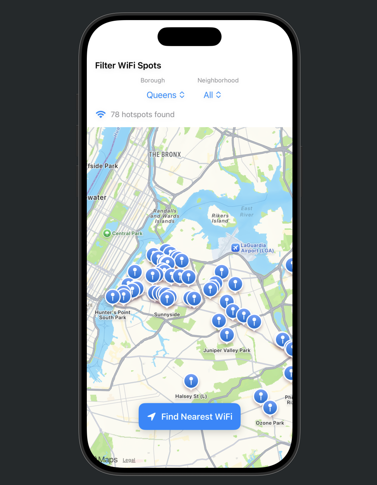
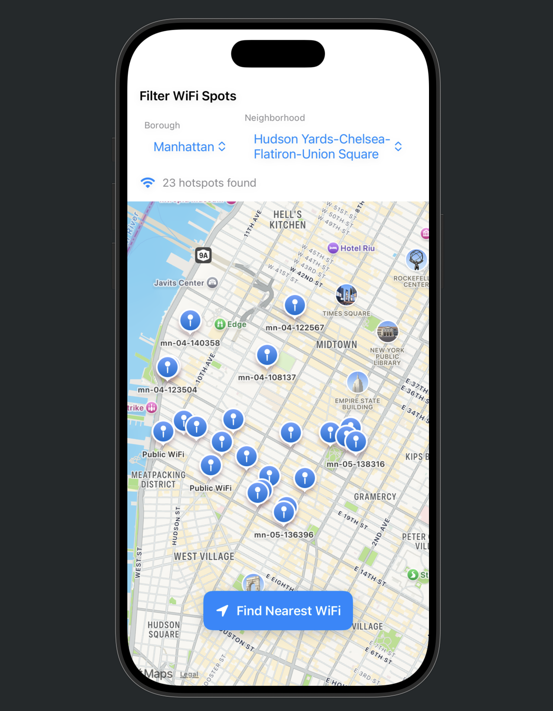
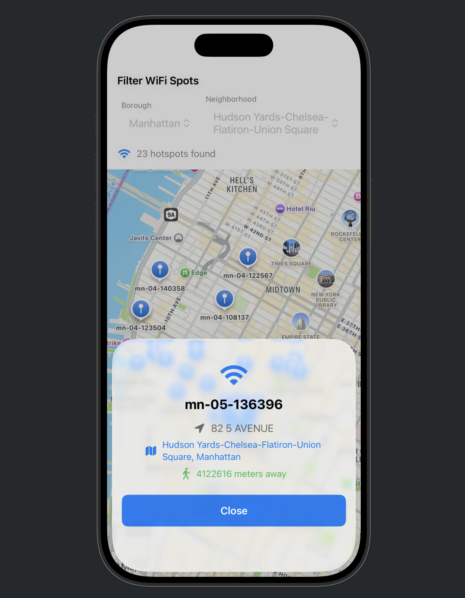

# NYC WiFi Finder

An iOS app to discover free public WiFi hotspots across New York City with AI-powered personalized recommendations.

## Status

**iOS App:** Complete and functional  
**Backend API:** Planned (Spring Boot + PostgreSQL)

The app currently works standalone with local data persistence. Backend integration is planned for cross-device sync.

## Tech Stack

**iOS (Complete)**
- Swift & SwiftUI
- MapKit
- CoreLocation
- Combine
- UserDefaults

**Backend (Planned)**
- Spring Boot
- PostgreSQL
- JWT Authentication
- Spring Security

## Features

**Current**
- Interactive map with 500+ NYC WiFi locations across all 5 boroughs
- Real-time location tracking
- Filter by borough and neighborhood
- Find nearest WiFi hotspot
- Bookmark system (local storage)
- Visit history tracking
- AI-powered recommendations based on location, preferences, and behavior
- Usage statistics

**Planned**
- User authentication
- Cloud sync
- Enhanced AI with Claude API via Model Context Protocol

## Screenshots

<p align="center">
  
  
  
</p>

## Installation

**Requirements**
- iOS 17.0+
- Xcode 15.0+

**Steps**
1. Clone the repository
```bash
git clone https://github.com/bobbramillan/nyc-wifi-finder.git
cd nyc-wifi-finder
```

2. Open in Xcode
```bash
open NYCWiFiFinder.xcodeproj
```

3. Run on simulator or device

## Recommendation Algorithm

The app uses a weighted scoring system:

- Proximity (40%): Prioritizes nearby locations
- Borough preference (25%): Learns favorite borough
- Neighborhood patterns (20%): Identifies frequent areas
- Bookmark similarity (15%): Suggests similar spots

## Data Source

WiFi hotspot data from [NYC Open Data](https://data.cityofnewyork.us/City-Government/NYC-Wi-Fi-Hotspot-Locations/yjub-udmw/about_data)

## Project Structure
```
NYCWiFiFinder/
├── Models/
├── Services/
├── Managers/
├── Views/
│   ├── MapView
│   ├── ForYouView
│   ├── BookmarksView
│   └── Components/
└── Extensions/
```

## Author

Bavanan Bramillan  
[GitHub](https://github.com/bobbramillan)

## License

MIT
